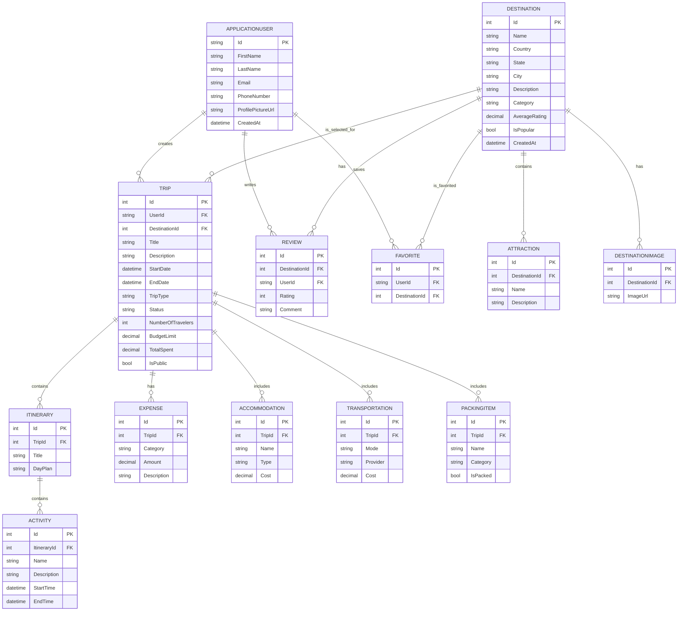

# ERD for Travel Planner

```mermaid
erDiagram
    APPLICATIONUSER ||--o{ TRIP : creates
    APPLICATIONUSER ||--o{ REVIEW : writes
    APPLICATIONUSER ||--o{ FAVORITE : saves

    DESTINATION ||--o{ TRIP : is_selected_for
    DESTINATION ||--o{ REVIEW : has
    DESTINATION ||--o{ ATTRACTION : contains
    DESTINATION ||--o{ DESTINATIONIMAGE : has
    DESTINATION ||--o{ FAVORITE : is_favorited

    TRIP ||--o{ ITINERARY : contains
    TRIP ||--o{ EXPENSE : has
    TRIP ||--o{ ACCOMMODATION : includes
    TRIP ||--o{ TRANSPORTATION : includes
    TRIP ||--o{ PACKINGITEM : includes

    ITINERARY ||--o{ ACTIVITY : contains

    APPLICATIONUSER {
        string Id PK
        string FirstName
        string LastName
        string Email
        string PhoneNumber
        string ProfilePictureUrl
        datetime CreatedAt
    }

    DESTINATION {
        int Id PK
        string Name
        string Country
        string State
        string City
        string Description
        string Category
        decimal AverageRating
        bool IsPopular
        datetime CreatedAt
    }

    TRIP {
        int Id PK
        string UserId FK
        int DestinationId FK
        string Title
        string Description
        datetime StartDate
        datetime EndDate
        string TripType
        string Status
        int NumberOfTravelers
        decimal BudgetLimit
        decimal TotalSpent
        bool IsPublic
    }

    ITINERARY {
        int Id PK
        int TripId FK
        string Title
        string DayPlan
    }

    ACTIVITY {
        int Id PK
        int ItineraryId FK
        string Name
        string Description
        datetime StartTime
        datetime EndTime
    }

    ACCOMMODATION {
        int Id PK
        int TripId FK
        string Name
        string Type
        decimal Cost
    }

    TRANSPORTATION {
        int Id PK
        int TripId FK
        string Mode
        string Provider
        decimal Cost
    }

    EXPENSE {
        int Id PK
        int TripId FK
        string Category
        decimal Amount
        string Description
    }

    PACKINGITEM {
        int Id PK
        int TripId FK
        string Name
        string Category
        bool IsPacked
    }

    REVIEW {
        int Id PK
        int DestinationId FK
        string UserId FK
        int Rating
        string Comment
    }

    FAVORITE {
        int Id PK
        string UserId FK
        int DestinationId FK
    }

    ATTRACTION {
        int Id PK
        int DestinationId FK
        string Name
        string Description
    }

    DESTINATIONIMAGE {
        int Id PK
        int DestinationId FK
        string ImageUrl
    }
```
